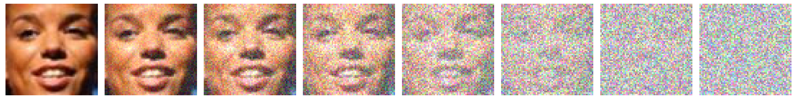
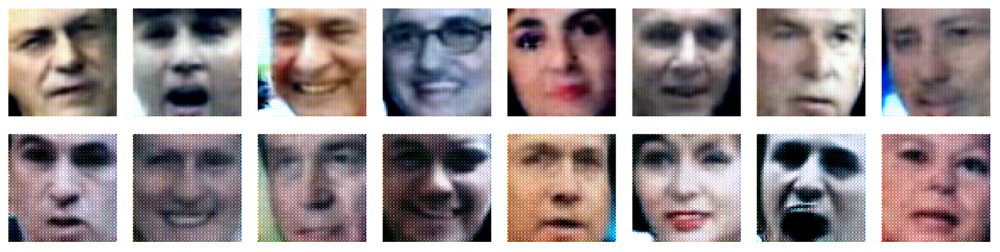

# Diffusion Model

A basic diffusion model based on the seminal paper by [Jonathan Ho et al.](https://arxiv.org/pdf/2006.11239.pdf)<br>

<br>

### Generated Images
These are a few examples of what this model generated after **a lot** of debugging.
<br><br>


### Trained Model

Find a few trained models and other things **[on HuggingFace.](https://huggingface.co/zrthxn/diffusion)**

### Dataset
[Smiling or Not Face Data](https://www.kaggle.com/datasets/chazzer/smiling-or-not-face-data)
from Kaggle.

The smiling or not smiling is not relevant to me, I just want to generate a face. 
I will combine all the categories of faces into one single dataset.

## Usage

Installation

```bash
pipenv shell
pipenv install
```

Download Dataset
```bash
git clone https://huggingface.co/datasets/zrthxn/SmilingOrNot data/faces
unzip data/faces/Archive.zip -d data/faces
```

Dryrun Sanity Check
```bash
python main.py train --dryrun
```

Full Training
```bash
python main.py train \
    --batch_size=128 \
    --device=cuda \
    --lr=0.001 \
    --epochs=100
```

## Resources
Papers
- [Denoising Diffusion Probabilistic Models](https://arxiv.org/pdf/2006.11239.pdf)
- [Deep Unsupervised Learning using Nonequilibrium Thermodynamics](https://arxiv.org/pdf/1503.03585.pdf)
- [Improved Denoising Diffusion Probabilistic Models](https://arxiv.org/pdf/2102.09672.pdf)

Videos and Code
- https://www.youtube.com/watch?v=HoKDTa5jHvg
- https://www.youtube.com/watch?v=a4Yfz2FxXiY
- https://amaarora.github.io/2020/09/13/unet.html
- https://lilianweng.github.io/posts/2021-07-11-diffusion-models/
- https://colab.research.google.com/drive/1sjy9odlSSy0RBVgMTgP7s99NXsqglsUL
